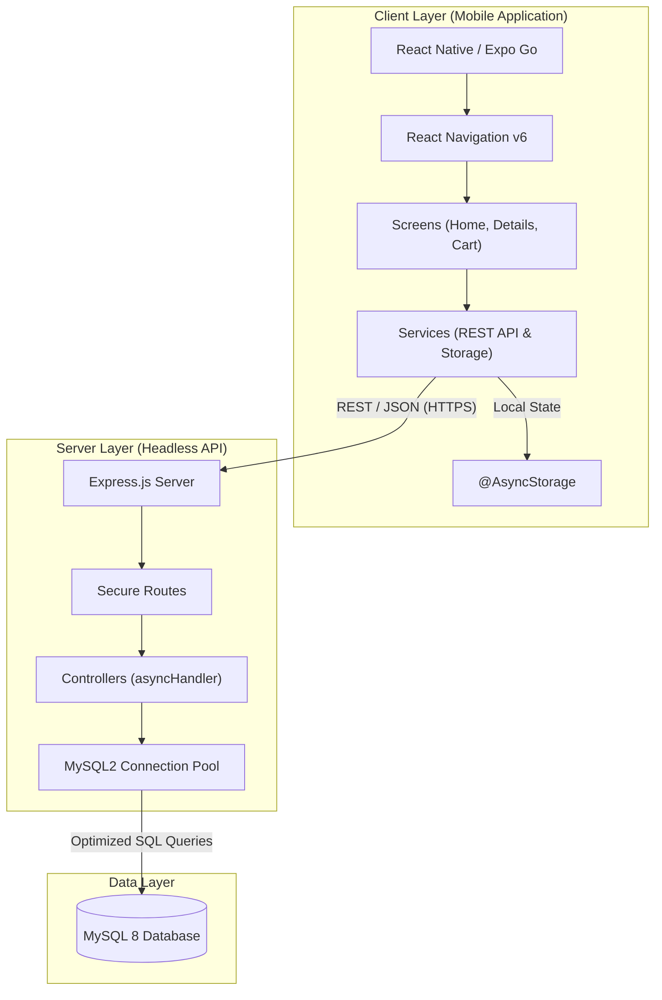

# Hxni Ecommerce Store

<p align="center">
  
  &nbsp;&nbsp;&nbsp;
  
</p>

> **Editorial Excellence meets E-commerce.**  
> A high-end mobile shopping experience defined by a minimalist aesthetic, bespoke typography, and a robust full-stack architecture. Built to deliver seamless performance on Android and iOS using React Native (Expo), Node.js, and MySQL.

---

## 🏗️ System Architecture

The application follows a modern decoupled architecture, ensuring clean separation of concerns between the mobile client and the headless API.



### Key Architectural Decisions
- **Decoupled Frontend**: The mobile application communicates with the backend via a JSON REST API, allowing for future web or desktop expansion.
- **Local Persistence**: Shopping cart data is persisted locally using `AsyncStorage`, ensuring the user's progress is saved across app restarts.
- **Connection Pooling**: The backend utilizes a `mysql2/promise` connection pool to efficiently handle concurrent database requests.
- **Editorial UI**: Designed with a focus on typography and negative space, leveraging `Playfair Display` for a luxury brand feel.

---

## 🛠️ Technology Stack

| Layer | Technology |
| :--- | :--- |
| **Mobile** | React Native · Expo Go |
| **Navigation** | React Navigation v6 (Native Stack + Bottom Tabs) |
| **Persistence** | @react-native-async-storage/async-storage |
| **Backend** | Node.js (Runtime) · Express.js (Framework) |
| **Database** | MySQL 8 (Relational Storage) |
| **Typography** | Playfair Display (Serif) · Source Sans 3 (Sans) · IBM Plex Mono (Labels) |

---

## 🎨 Design System

| Token | Value | Visual | Usage |
| :--- | :--- | :--- | :--- |
| **Background** | `#FAFAF8` |  | Ivory — Main canvas |
| **Foreground** | `#1A1A1A` |  | Rich Black — Primary text |
| **Accent** | `#B8860B` |  | Antique Gold — Branding |
| **Border** | `#E8E4DF` |  | Hairlines & Dividers |

---

## 📂 Project Structure

```bash
hxni-ecommerce-store/
├── backend/
│   ├── config/db.js          # Database connection pooling
│   ├── controllers/          # Business logic & SQL execution
│   ├── routes/               # API endpoint definitions
│   ├── server.js             # Entry point & middleware
│   └── .env.example          # Environment configuration
├── frontend/
│   ├── src/
│   │   ├── components/       # Reusable UI (GoldButton, EditorialText)
│   │   ├── navigation/       # Tab & Stack Navigators
│   │   ├── screens/          # Core views (Home, Details, Cart)
│   │   ├── services/         # API wrappers & AsyncStorage logic
│   │   └── theme/            # Design tokens (Palette, Spacing)
│   └── App.js                # Bootstrap & Global Providers
└── db/
    └── schema.sql            # MySQL Schema & Seed Data
```

---

## 🚀 Installation & Setup

### 1. Database Initialization
Ensure MySQL is running, then execute the schema:
```bash
mysql -u root -p < db/schema.sql
```

### 2. Backend Configuration
Navigate to the `backend` directory, install dependencies, and configure the environment:
```bash
cd backend
npm install
cp .env.example .env # Update with your DB credentials
npm run dev
```

### 3. Frontend Deployment
Update the `BASE_URL` in `frontend/src/services/api.js` to your local IP address, then start Expo:
```bash
cd frontend
npm install
npx expo start
```

---

## 📱 Download Preview

Scan the QR code below to download the production APK (Android) or use the Direct Link.

<p align="center">
  
</p>

<p align="center">
  <a href="https://expo.dev/artifacts/eas/3eVKpyrE2368mTk83CedWW.apk">
    <strong>Download APK (v1.0.0)</strong>
  </a>
</p>

---

## ⚖️ API Reference

| Method | Endpoint | Description |
| :--- | :--- | :--- |
| `GET` | `/health` | Service uptime and status |
| `GET` | `/api/products` | Retrieve all curated items |
| `GET` | `/api/products/:id` | Detailed product view |

---

<p align="center">
  <em>Developed with ❤️ by Hxni. Built for the modern editor.</em>
</p>
